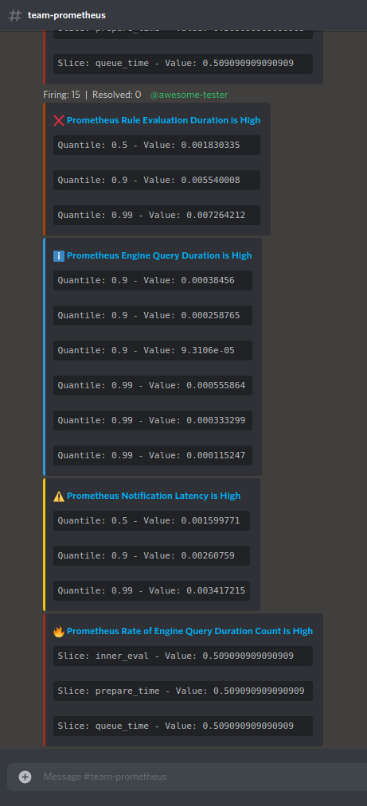

# Alertmanager Discord Webhook


## Goal

The goal of this applications is to serve as a customizable Discord webhook for Alertmanager.

With its default configuration, the application behaves similarly to [benjojo's alertmanager-discord](https://github.com/benjojo/alertmanager-discord), aggregating alerts by status and sending them with a colored embed accordingly. Adding to that, we're able to route alerts to multiple channels in a single instance and group by `alertname`.

However, there are a few other things you might want in a production environment, such as:

- Define Discord Roles to be mentioned when:
  - There are too many firing alerts;
  - Any of the alerts contains a specified severity value, like "critical" or "disaster";
- Change Embed appearance to provide better visual clues of what is going on;
- Define a priority to each severity, so the alerts are always shown in an expected order.

## How it looks like

> To reproduce these prints, check [Develop and Experiment](#develop-and-experiment)

In it's default configuration, here's how the message should look like:


Using severity message type:



## How To Use It

The application expects Alertmanager's webhook body in the path `/:channel`. The `channel` should match one of the provided Discord channel keys in the [configuration](#configuration). As stated before, you can have as many channels as you want, as long as they are represented by a different key in the `channels` config property. That is the only routing logic provided by this application, since Alertmanager has a rich routing configuration itself, based on label matching. You can freely [Experiment with this configurations](#develop-and-experiment) using this repo.

1. You begin by defining [alert rules](mock/prometheus/alert-rules/alert-rules.yaml) in Prometheus. This rules will be evaluated and sent to Alertmanager as defined in the `alerting` field in [prometheus.yaml](mock/prometheus/prometheus.yaml) configuration.
2. Then you should create your routing logic in [Alertmanager's config file](mock/alertmanager/config.yaml), using labels to define which receivers (webhooks in our case) should handle the Alerts. That is the moment we define to which Discord channel the alerts will be sent. Here's a snippet from the config:

```yaml
  routes:
    # Any alert that contains the label "owner: team-go" should be sent to the
    # Discord Channel #team-go, represented by the receiver "discord-team-go"
    - match:
        owner: team-prometheus
      receiver: "discord-team-prometheus"
      continue: false
    - match:
        owner: team-go
      receiver: "discord-team-go"
      # If you want matching alerts to also go to the global receiver "discord-default"
      # set "continue: true". They'll join alerts not matched and will be sent together.
      continue: true
    - receiver: "discord-default"
receivers:
  - name: "discord-default"
    webhook_configs:
      - send_resolved: true
        url: "http://app:8080/default"
  - name: "discord-team-go"
    webhook_configs:
      - send_resolved: true
        url: "http://app:8080/team-go"
  - name: "discord-team-prometheus"
    webhook_configs:
      - send_resolved: true
        url: "http://app:8080/team-prometheus"
```

3. Last, but not least, you should configure the application choosing one of the following approaches:
   1. Status based: If `messageType` is set to `status` (the default), the application will only group alerts by name and send them with embeds stylized accordingly to `status`.
   2. Severity based: If `messageType` is set to `severity`, some features will be enabled, such as:
      1. Choose the label name that carries the severity levels. Default is `severity`;
      2. Change the embed's color and title emoji based on severity value;
      3. *Choose which severities should trigger a mention in Discord;
      4. *Choose which severities can be ignored when not accompanied by others. E.g.: Only send alerts with severity "information" if any other of higher severity is also triggered;

> *Can be set globally or by Channel

Take a look at the [example config](config.example.yaml)! Each property is commented for better understanding. You can use either JSON or YAML for the config file, as long as it finishes with one of the following extensions: `.json`, `.yaml`, `.yml`

Copy the example config to a file named `my-config.yaml` and use your own *webhookURLs*. This is the filename expected by docker-compose. This file is gitignored.

### Install in Kubernetes with Helm

There's a Helm Chart available at [masgustavos/helm/alertmanager-discord](https://github.com/masgustavos/helm/tree/main/charts/alertmanager-discord). Take a look at the [example values](mock/helm/) for both the [alertmanager-discord](mock/helm/values-ad.yaml) and the [community Prometheus Helm Chart](https://github.com/prometheus-community/helm-charts) (which includes the config for Alertmanager).

```bash
# Add the repository
helm repo add masgustavos https://masgustavos.github.io/helm
# Install the chart
helm install alertmanager-discord --values <path_to_your_values> masgustavos/alertmanager-discord
```


## Develop and Experiment

> Remember to copy the [config.example.yaml](config.example.yaml) file to a file named `my-config.yaml` and change the webhookURLs! If you want to use a different name, remember to change the `CONFIG_PATH` ENV var on [docker-compose.yaml](docker-compose.yaml).

There's a [docker-compose.yaml](docker-compose.yaml) with an ephemeral Prometheus and Alertmanager, so you can spin up a small environment and test different configurations. The configuration files to be mounted in the testing containers can be found in the [mock](mock/) folder:

- [alertmanager/config.yaml](mock/alertmanager/config.yaml): Experiment with route matching and receivers to experience what the app has to offer;
  - [Routing tree editor](https://www.prometheus.io/webtools/alerting/routing-tree-editor/)
  - [Route Configuration](https://prometheus.io/docs/alerting/latest/configuration/#route)
- [prometheus/prometheus.yaml](mock/prometheus/prometheus.yaml): Configure Prometheus to your liking (`scrape_interval`, `evaluation_interval`, etc.) and define any necessary `external_labels`;
- [prometheus/alert-rules/](mock/prometheus/alert-rules/): Define as many alert rules as you want in the `*.yaml` format (as defined in [prometheus/prometheus.yaml](mock/prometheus/prometheus.yaml)).

To execute the application simply run `docker-compose up`. Whenever you change your config, run `docker-compose restart app`.

### ToDO

- Send message in batches when there is more than 10 embeds;

## Miscellaneous

- Discord Colors

```yaml
EmbedColorAqua: 1752220
EmbedColorGreen: 3066993
EmbedColorBlue: 3447003
EmbedColorPurple: 10181046
EmbedColorGold: 15844367
EmbedColorOrange: 15105570
EmbedColorRed: 15158332
EmbedColorGrey: 9807270
EmbedColorDarkerGrey: 8359053
EmbedColorNavy: 3426654
EmbedColorDarkAqua: 1146986
EmbedColorDarkGreen: 2067276
EmbedColorDarkBlue: 2123412
EmbedColorDarkPurple: 7419530
EmbedColorDarkGold: 12745742
EmbedColorDarkOrange: 11027200
EmbedColorDarkRed: 10038562
EmbedColorDarkGrey: 9936031
EmbedColorLightGrey: 12370112
EmbedColorDarkNavy: 2899536
EmbedColorLuminousVividPink: 16580705
EmbedColorDarkVividPink: 12320855
```
